# WLAN offloads

This code example demonstrates various WLAN offloads such as Address Resolution Protocol (ARP) offload, packet filter offload, and the TCP keepalive offload functionality offered by Infineon AIROC&trade; Wi-Fi devices using PSoC&trade; 6 MCU. It employs the [low power assistant](https://github.com/Infineon/lpa) (LPA) middleware library, which helps in developing low-power applications for Infineon devices.

The WLAN offload functionalities allow the WLAN device to handle incoming TCP keepalive, ARP, and packet filter packets from the network on its own so that the PSoC&trade; 6 MCU remains longer in the low-power mode.

[View this README on GitHub.](https://github.com/Infineon/mtb-example-wlan-offloads)

[Provide feedback on this code example.](https://cypress.co1.qualtrics.com/jfe/form/SV_1NTns53sK2yiljn?Q_EED=eyJVbmlxdWUgRG9jIElkIjoiQ0UyMjk5MjYiLCJTcGVjIE51bWJlciI6IjAwMi0yOTkyNiIsIkRvYyBUaXRsZSI6IldMQU4gb2ZmbG9hZHMiLCJyaWQiOiJjaGV0dGlhbm5hbiIsIkRvYyB2ZXJzaW9uIjoiNS41LjAiLCJEb2MgTGFuZ3VhZ2UiOiJFbmdsaXNoIiwiRG9jIERpdmlzaW9uIjoiTUNEIiwiRG9jIEJVIjoiSUNXIiwiRG9jIEZhbWlseSI6IldJRkkifQ==)

## Requirements

- [ModusToolbox&trade;](https://www.infineon.com/modustoolbox) v3.1 or later (tested with v3.1)
- Board support package (BSP) minimum required version: 4.0.0
- Programming language: C
- Other tools: Python v3.8.10 or later
- Associated parts: All [PSoC&trade; 6 MCU](https://www.infineon.com/PSoC6) parts with SDIO, [PSoC&trade; 6 MCU with AIROC&trade; CYW43012 Wi-Fi & Bluetooth&reg; combo chip](https://www.infineon.com/cms/en/product/wireless-connectivity/airoc-wi-fi-plus-bluetooth-combos/wi-fi-4-802.11n/cyw43012/), [PSoC&trade; 6 MCU with AIROC&trade; CYW4343W Wi-Fi & Bluetooth&reg; combo chip](https://www.infineon.com/cms/en/product/wireless-connectivity/airoc-wi-fi-plus-bluetooth-combos/wi-fi-4-802.11n/cyw4343w/)


## Supported toolchains (make variable 'TOOLCHAIN')

- GNU Arm&reg; Embedded Compiler v11.3.1 (`GCC_ARM`) – Default value of `TOOLCHAIN`
- Arm&reg; Compiler v6.16 (`ARM`)
- IAR C/C++ Compiler v9.30.1 (`IAR`)

## Supported kits (make variable 'TARGET')

- [PSoC&trade; 62S2 Wi-Fi Bluetooth&reg; Prototyping Kit](https://www.infineon.com/CY8CPROTO-062S2-43439) (`CY8CPROTO-062S2-43439`) – Default value of `TARGET`
- [PSoC&trade; 6 Wi-Fi Bluetooth&reg; Prototyping Kit](https://www.infineon.com/CY8CPROTO-062-4343W) (`CY8CPROTO-062-4343W`)
- [PSoC&trade; 6 Wi-Fi Bluetooth&reg; Pioneer Kit](https://www.infineon.com/CY8CKIT-062-WIFI-BT) (`CY8CKIT-062-WIFI-BT`)
- [PSoC&trade; 62S2 Wi-Fi Bluetooth&reg; Pioneer Kit](https://www.infineon.com/CY8CKIT-062S2-43012) (`CY8CKIT-062S2-43012`)
- [PSoC&trade; 62S1 Wi-Fi Bluetooth&reg; Pioneer Kit](https://www.infineon.com/CYW9P62S1-43438EVB-01) (`CYW9P62S1-43438EVB-01`)
- [PSoC&trade; 62S1 Wi-Fi Bluetooth&reg; Pioneer Kit](https://www.infineon.com/CYW9P62S1-43012EVB-01) (`CYW9P62S1-43012EVB-01`)
- [PSoC&trade; 64 "Secure Boot" Wi-Fi Bluetooth&reg; Pioneer Kit](https://www.infineon.com/CY8CKIT-064B0S2-4343W) (`CY8CKIT-064B0S2-4343W`)
- [PSoC&trade; 62S3 Wi-Fi Bluetooth&reg; Prototyping Kit](https://www.infineon.com/CY8CPROTO-062S3-4343W) (`CY8CPROTO-062S3-4343W`)
- [PSoC&trade; 62S2 Evaluation Kit](https://www.infineon.com/CY8CEVAL-062S2) (`CY8CEVAL-062S2-LAI-4373M2`, `CY8CEVAL-062S2-MUR-43439M2`, `CY8CEVAL-062S2-LAI-43439M2`, `CY8CEVAL-062S2-MUR-4373EM2`, `CY8CEVAL-062S2-MUR-4373M2`,`CY8CEVAL-062S2-CYW955513SDM2WLIPA`)
- Rapid IoT Connect Developer Kit (`CYSBSYSKIT-DEV-01`)
- [PSoC&trade; 6 AI Evaluation Kit](https://www.infineon.com/CY8CKIT-062S2-AI) (`CY8CKIT-062S2-AI`)

## Hardware setup

This example uses the board's default configuration. See the kit user guide to ensure that the board is configured correctly.

> **Note:** The PSoC&trade; 6 Wi-Fi Bluetooth&reg; Pioneer Kit (CY8CKIT-062-WIFI-BT) ships with KitProg2 installed. The ModusToolbox&trade; requires KitProg3. Before using this code example, make sure that the board is upgraded to KitProg3. The tool and instructions are available in the [Firmware Loader](https://github.com/Infineon/Firmware-loader) GitHub repository. If you do not upgrade, you will see an error like "unable to find CMSIS-DAP device" or "KitProg firmware is out of date".


## Software setup

1. Install a terminal emulator if you don't have one. Instructions in this document use [Tera Term](https://ttssh2.osdn.jp/index.html.en).
2. Install [Wireshark](https://www.wireshark.org/download.html) for capturing network packets over the air.
3. Install the *ARP'ing* network utility:
   - [Windows OS](https://www.elifulkerson.com/projects/arp-ping.php)
   - [macOS](https://macappstore.org/arping/)
   - On Linux, use the `sudo apt install arping` command. Most of the Ubuntu OS distributions have it natively available.
4. Install the Python interpreter and add it to the top of the system path in environmental variables. This code example is tested with [Python v3.8.10](https://www.python.org/downloads/release/python-3810/).

## Using the code example

### Create the project

The ModusToolbox&trade; tools package provides the Project Creator as both a GUI tool and a command line tool.

<details><summary><b>Use Project Creator GUI</b></summary>

1. Open the Project Creator GUI tool.

   There are several ways to do this, including launching it from the dashboard or from inside the Eclipse IDE. For more details, see the [Project Creator user guide](https://www.infineon.com/ModusToolboxProjectCreator) (locally available at *{ModusToolbox&trade; install directory}/tools_{version}/project-creator/docs/project-creator.pdf*).

2. On the **Choose Board Support Package (BSP)** page, select a kit supported by this code example. See [Supported kits](#supported-kits-make-variable-target).

   > **Note:** To use this code example for a kit not listed here, you may need to update the source files. If the kit does not have the required resources, the application may not work.

3. On the **Select Application** page:

   a. Select the **Applications(s) Root Path** and the **Target IDE**.

   > **Note:** Depending on how you open the Project Creator tool, these fields may be pre-selected for you.

   b.	Select this code example from the list by enabling its check box.

   > **Note:** You can narrow the list of displayed examples by typing in the filter box.

   c. (Optional) Change the suggested **New Application Name** and **New BSP Name**.

   d. Click **Create** to complete the application creation process.

</details>

<details><summary><b>Use Project Creator CLI</b></summary>

The 'project-creator-cli' tool can be used to create applications from a CLI terminal or from within batch files or shell scripts. This tool is available in the *{ModusToolbox&trade; install directory}/tools_{version}/project-creator/* directory.

Use a CLI terminal to invoke the 'project-creator-cli' tool. On Windows, use the command-line 'modus-shell' program provided in the ModusToolbox&trade; installation instead of a standard Windows command-line application. This shell provides access to all ModusToolbox&trade; tools. You can access it by typing "modus-shell" in the search box in the Windows menu. In Linux and macOS, you can use any terminal application.

The following example clones the "[mtb-example-wlan-offloads](https://github.com/Infineon/mtb-example-wlan-offloads)" application with the desired name "WlanOffloads" configured for the *CY8CPROTO-062S2-43439* BSP into the specified working directory, *C:/mtb_projects*:

   ```
   project-creator-cli --board-id CY8CPROTO-062S2-43439 --app-id mtb-example-wlan-offloads --user-app-name WlanOffloads --target-dir "C:/mtb_projects"
   ```

The 'project-creator-cli' tool has the following arguments:

Argument | Description | Required/optional
---------|-------------|-----------
`--board-id` | Defined in the <id> field of the [BSP](https://github.com/Infineon?q=bsp-manifest&type=&language=&sort=) manifest | Required
`--app-id`   | Defined in the <id> field of the [CE](https://github.com/Infineon?q=ce-manifest&type=&language=&sort=) manifest | Required
`--target-dir`| Specify the directory in which the application is to be created if you prefer not to use the default current working directory | Optional
`--user-app-name`| Specify the name of the application if you prefer to have a name other than the example's default name | Optional

> **Note:** The project-creator-cli tool uses the `git clone` and `make getlibs` commands to fetch the repository and import the required libraries. For details, see the "Project creator tools" section of the [ModusToolbox&trade; tools package user guide](https://www.infineon.com/ModusToolboxUserGuide) (locally available at {ModusToolbox&trade; install directory}/docs_{version}/mtb_user_guide.pdf).

</details>


### Open the project

After the project has been created, you can open it in your preferred development environment.


<details><summary><b>Eclipse IDE</b></summary>

If you opened the Project Creator tool from the included Eclipse IDE, the project will open in Eclipse automatically.

For more details, see the [Eclipse IDE for ModusToolbox&trade; user guide](https://www.infineon.com/MTBEclipseIDEUserGuide) (locally available at *{ModusToolbox&trade; install directory}/docs_{version}/mt_ide_user_guide.pdf*).

</details>


<details><summary><b>Visual Studio (VS) Code</b></summary>

Launch VS Code manually, and then open the generated *{project-name}.code-workspace* file located in the project directory.

For more details, see the [Visual Studio Code for ModusToolbox&trade; user guide](https://www.infineon.com/MTBVSCodeUserGuide) (locally available at *{ModusToolbox&trade; install directory}/docs_{version}/mt_vscode_user_guide.pdf*).

</details>


<details><summary><b>Keil µVision</b></summary>

Double-click the generated *{project-name}.cprj* file to launch the Keil µVision IDE.

For more details, see the [Keil µVision for ModusToolbox&trade; user guide](https://www.infineon.com/MTBuVisionUserGuide) (locally available at *{ModusToolbox&trade; install directory}/docs_{version}/mt_uvision_user_guide.pdf*).

</details>


<details><summary><b>IAR Embedded Workbench</b></summary>

Open IAR Embedded Workbench manually, and create a new project. Then select the generated *{project-name}.ipcf* file located in the project directory.

For more details, see the [IAR Embedded Workbench for ModusToolbox&trade; user guide](https://www.infineon.com/MTBIARUserGuide) (locally available at *{ModusToolbox&trade; install directory}/docs_{version}/mt_iar_user_guide.pdf*).

</details>


<details><summary><b>Command line</b></summary>

If you prefer to use the CLI, open the appropriate terminal, and navigate to the project directory. On Windows, use the command-line 'modus-shell' program; on Linux and macOS, you can use any terminal application. From there, you can run various `make` commands.

For more details, see the [ModusToolbox&trade; tools package user guide](https://www.infineon.com/ModusToolboxUserGuide) (locally available at *{ModusToolbox&trade; install directory}/docs_{version}/mtb_user_guide.pdf*).

</details>


## Operation


If using a PSoC&trade; 64 "Secure" MCU kit (like CY8CKIT-064B0S2-4343W), the PSoC&trade; 64 device must be provisioned with keys and policies before being programmed. Follow the instructions in the ["Secure Boot" SDK user guide](https://www.infineon.com/dgdlac/Infineon-PSoC_64_Secure_MCU_Secure_Boot_SDK_User_Guide-Software-v07_00-EN.pdf?fileId=8ac78c8c7d0d8da4017d0f8c361a7666) to provision the device. If the kit is already provisioned, copy-paste the keys and policy folder to the application folder.

1. Connect the board to your PC using the provided USB cable through the KitProg3 USB connector.

2. Open *app_config.h* and modify the `WIFI_SSID`, `WIFI_PASSWORD`, and `WIFI_SECURITY_TYPE` macros to match the Wi-Fi network credentials that you want to connect to.

   Defined all possible security types in the `cy_wcm_security_t` structure in *cy_wcm.h* file.

3. Ensure that your PC is connected to the same Wi-Fi access point (AP) that you configured in Step 2.

   All WLAN offload settings are already done for this example in the device configurator except for the IP address of the server (your PC). See [Configure WLAN offloads using the device configurator](#configure-wlan-offloads-using-the-device-configurator) to learn how to configure the IP address of the server.

4. Open a terminal program and select the KitProg3 COM port. Set the serial port parameters to 8N1 and 115200 baud.

5. Open a command shell and run the Python TCP echo server (*tcp_server.py*) from the project directory. The Python script starts a TCP server and the server starts listening for incoming TCP connections.

   > **Note:** The default port number is defined as `50007` in the *tcp_server.py* script. Specify a custom port number between 1 and 65535 that you would like to use.

   ```
   python tcp_server.py --port 3360
   ```
   where `3360` is the port number of the server (destination port number), which is already configured in the device configurator.

   > **Note:** Ensure that the firewall settings of your PC allow access to the Python software so that it can communicate with the TCP client. See this [community thread](https://community.infineon.com/thread/53662).

6. Program the board using one of the following:

   <details><summary><b>Using Eclipse IDE</b></summary>

      1. Select the application project in the Project Explorer.

      2. In the **Quick Panel**, scroll down, and click **\<Application Name> Program (KitProg3_MiniProg4)**.
   </details>


   <details><summary><b>In other IDEs</b></summary>

   Follow the instructions in your preferred IDE.
   </details>


   <details><summary><b>Using CLI</b></summary>

     From the terminal, execute the `make program` command to build and program the application using the default toolchain to the default target. The default toolchain is specified in the application's Makefile but you can override this value manually:
      ```
      make program TOOLCHAIN=<toolchain>
      ```

      Example:
      ```
      make program TOOLCHAIN=GCC_ARM
      ```
   </details>

7. After programming, the application starts automatically. Verify that the following logs appear on the serial terminal:

    ```
    Info: =====================================
    Info: CE229926 - WLAN Offloads
    Info: =====================================

    WLAN MAC Address : A0:C9:A0:3D:D3:6A
    WLAN Firmware    : wl0: Jan 30 2020 21:41:53 version 7.45.98.95 (r724303 CY) FWID 01-5afc8c1e
    WLAN CLM         : API: 12.2 Data: 9.10.39 Compiler: 1.29.4 ClmImport: 1.36.3 Creation: 2020-01-30 21:30:05
    WHD VERSION      : v1.92.0 : v1.92.0 : GCC 9.3 : 2020-09-25 03:12:36 -0500
    Info: Wi-Fi initialization is successful
    Info: Join to AP: WIFI_SSID
    Info: Successfully joined wifi network WIFI_SSID
    Info: Assigned IP address: 192.168.0.15
    Info: Taking Offload manager configurations from the Generated sources.
    Info: Socket[0]: Created connection to IP 192.168.0.10, local port 3353, remote port 3360
    Info: Skipped TCP socket connection for socket id[1]. Check the TCP Keepalive configuration.
    Info: Skipped TCP socket connection for socket id[2]. Check the TCP Keepalive configuration.
    Info: Skipped TCP socket connection for socket id[3]. Check the TCP Keepalive configuration.
    whd_tko_toggle: Successfully enabled

    Network Stack Suspended, MCU will enter DeepSleep power mode
    ```

8. Use the Wireshark sniffer tool for capturing TCP keepalive packets on Windows, Ubuntu, and macOS.

      **Figure 1. TCP keepalive capture on Wireshark**

      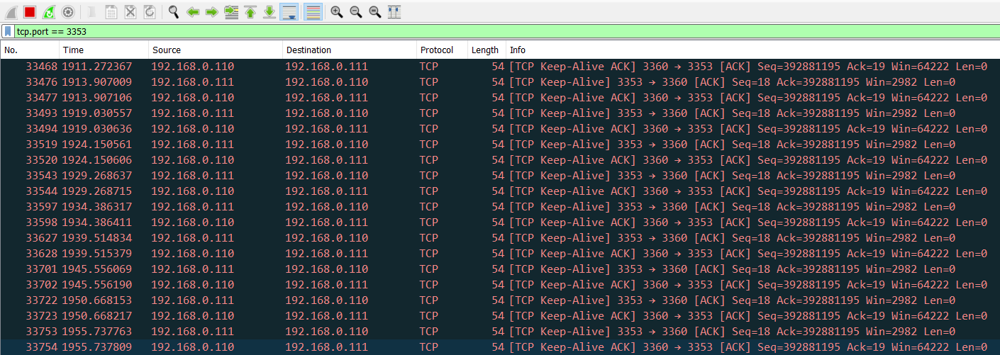


9. Verify the functioning of ARP offload by sending an ARP request packet from your PC. Observe that the responses are received from the WLAN device without interrupting the host MCU from deep sleep.

   ```
   $ arp-ping 192.168.0.15
     Reply that E8:E8:B7:A0:29:1C is 192.168.0.15 in 0.434ms
     Reply that E8:E8:B7:A0:29:1C is 192.168.0.15 in 0.103ms
     Reply that E8:E8:B7:A0:29:1C is 192.168.0.15 in 0.109ms
     Reply that E8:E8:B7:A0:29:1C is 192.168.0.15 in 0.124ms
   ```
   To send the `arp-ping` command every 'x' seconds, use the following command:
   ```
   $ arp-ping -i X <IP Address>
   ```
   where `i` denotes the interval; ARP request packets will be sent every `X` seconds.

10. Verify the functioning of packet filters by sending a ping request from your PC.

      Observe that these ping requests time out and do not get any response from the WLAN device because the packet filter configuration did not include the ping packet type (ICMP of type 0x1). The WLAN device simply discards any ping request packets coming from network peers without interrupting the host MCU in deep sleep. This helps the host MCU not have to act on the unwanted network packets.

      ```
      $ ping 192.168.0.15

      Pinging 192.168.0.15 with 32 bytes of data:
      Request timed out.
      Request timed out.

      Ping statistics for 192.168.0.15:
         Packets: Sent = 2, Received = 0, Lost = 2 (100% loss),
      ```

      These steps indicate that the host MCU stays in deep sleep power mode while the WLAN device responds to ARP requests from network peers, filters unwanted network packets, and sends and receives TCP keepalive packets. In a real application use case, the host may choose to perform other useful tasks that the application requires instead of just entering deep sleep. This will improve the application performance because the host MCU has offloaded some of its network activities to the WLAN device.

      PSoC&trade; 6 MCU wakes up only when required by the WLAN device in the following conditions:

      - WLAN receives any TCP data from the server. For example, a ping (ICMP request packet) from a peer device wakes the PSoC&trade; 6 MCU device.

      - WLAN receives a link-down event (station disconnects from the AP)

      Test this application in a less congested network to avoid possible host wakeups by the network peers.

##  Debugging

You can debug the example to step through the code. In the IDE, use the **\<Application Name> Debug (KitProg3_MiniProg4)** configuration in the **Quick Panel**. For details, see the "Program and debug" section in the [Eclipse IDE for ModusToolbox&trade; user guide](https://www.infineon.com/MTBEclipseIDEUserGuide).

> **Note:** **(Only while debugging)** On the CM4 CPU, some code in `main()` may execute before the debugger halts at the beginning of `main()`. This means that some code executes twice – once before the debugger stops execution, and again after the debugger resets the program counter to the beginning of `main()`. See [KBA231071](https://community.infineon.com/docs/DOC-21143) to learn about this and for the workaround.

</details>


<details><summary><b>In other IDEs</b></summary>

Follow the instructions in your preferred IDE.
</details>


## Design and implementation

###  Resources and settings

[Low power assistant](https://github.com/Infineon/lpa) (LPA) provides an easy way to develop low-power applications for [supported devices](#supported-kits). LPA supports the following features:

- MCU low-power

- Wi-Fi and Bluetooth&reg; low-power

- Wi-Fi ARP offload

- Wi-Fi packet filter offload

- Wi-Fi WLAN offloads

This readme focuses on Wi-Fi WLAN offloads. This feature offloads the TCP keepalive, ARP, and packet filter functionality to the WLAN device, allowing the host MCU to enter sleep and deep sleep states. Therefore, reducing the overall system power consumption.

The WLAN firmware sends and receives TCP keepalive packets with the TCP server (a different machine or a PC running a TCP server that listens for an incoming TCP connection).

###  TCP keepalive

A TCP keepalive packet is a message sent by one device to another to check whether the link between the two is operational or to prevent the link from being disconnected. When two devices connect over a network via TCP/IP, TCP keepalive packets can be used to determine whether the connection is still valid and terminate if needed.

If a connection has been terminated because of a TCP keepalive timeout and the other device eventually sends a packet for the old connection, the device that terminated the connection sends a packet with the RST flag set to signal the other device that the old connection is no longer active. This forces the other device to terminate its end of the connection, therefore, a new connection can be established.

Therefore, TCP keepalive packets can be used in checking for dead peers or for preventing disconnection because of network inactivity.

###  TCP keepalive offload

Typically, TCP keepalive packets are sent every 45 or 60 seconds on an idle TCP connection; the connection drops after three sequential ACKs miss. This means that the host MCU must wake up periodically to send TCP keepalive packets to maintain the TCP connection during the idle state.

The TCP keepalive offloads part of the LPA help you improve the power consumption of your connected system by reducing the time the host needs to stay awake to support TCP keepalive requests. This is achieved by offloading the TCP keepalive functionality to the WLAN device so that the host MCU can be dedicated to your application.

This section describes how to enable TCP keepalive offload and configure four different sockets for TCP connections.

**Figure 2** shows that the host wakes up for incoming TCP traffic when offload is not enabled. On the other hand, the host can save more power by entering and staying in deep sleep for a longer time when the TCP keepalive activity is offloaded to the WLAN device.

**Figure 2. TCP keepalive offload disabled vs. enabled**

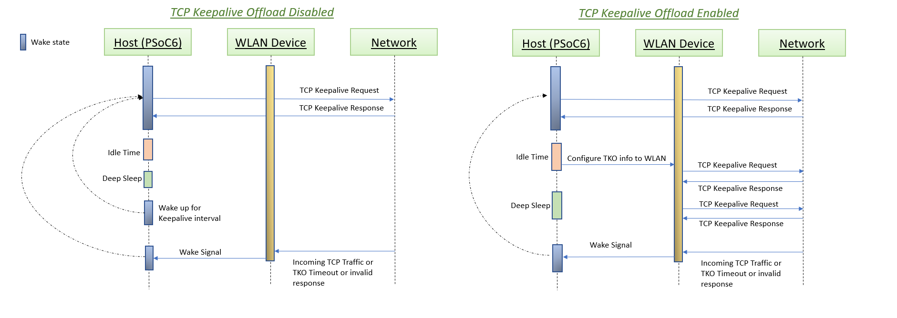


### ARP offload

ARP is a protocol that employs broadcast frames to perform IP address-to-MAC address lookup from an IP address like `192.168.1.1` to a physical machine address (MAC) like `ac:32:df:14:16:07`. ARP offload reduces the power consumption of your connected systems by reducing the time the host needs to stay awake due to ARP broadcast traffic.

ARP broadcast traffic is normally always forwarded from the network to the WLAN device to the host network stack. If the host is sleeping, an ARP packet is a wakeup trigger. Having the WLAN device handle some of the ARP traffic will reduce the frequency of host wakeup triggers and reduce the host power consumption.

This application demonstrates the *Peer Auto Reply* functionality from the ARP offload feature. The WLAN device firmware is configured to respond to ARP requests from the network peers. If the WLAN device IP address table contains the host IP address, the WLAN device will fabricate an ARP reply to an ARP request from the network ('don't bother the host'), allowing the host to stay in deep sleep. This is a power-saving feature, as the host can stay in deep sleep longer. Based on the application use case, the MCU can be put into deep sleep during the RTOS idle time or can choose to do other important jobs.

**Figure 3. ARP offload enabled vs disabled**

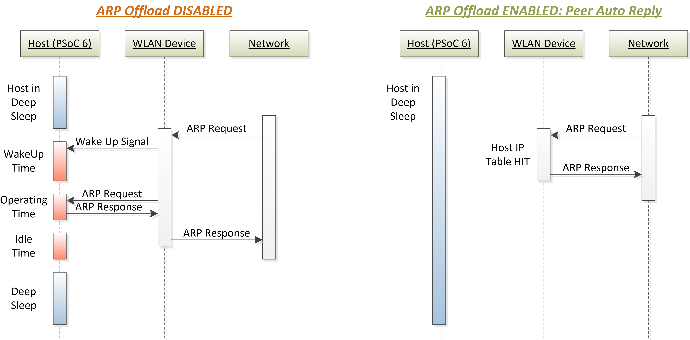

### Packet filter offload

The packet filter helps to filter out unwanted network packets from reaching the host MCU and waking it up from deep sleep. This helps the host to stay in deep sleep longer. The WLAN network packets can be filtered based on the port (at the application layer in the OSI model), IP protocol type (transport layer), or Ether Type (network layer).

The Internet Assigned Numbers Authority (IANA) maintains the official assignments of port numbers, protocol numbers, or Ether type for WLAN packets. See the [IANA Protocols Registry](https://www.iana.org/protocols) for information on the protocol numbers.

**Figure 4. Packet filters on standard IP stack**

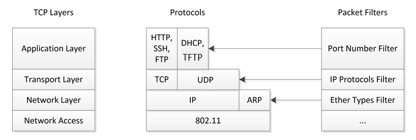

**Figure 5. Packet filter enabled vs disabled**

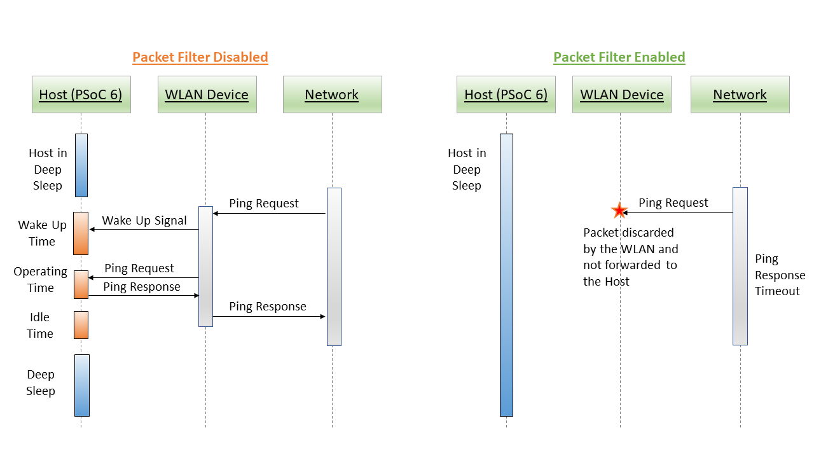


> **Note:** The WLAN activities are offloaded only when the host MCU goes to sleep and the network stack is suspended.

The application does the following when the kit is powered up:

1. Initializes the WLAN device as an STA (Station) interface.

2. Initializes the offload manager (OLM) with the configuration present in the *GeneratedSources/cycfg_connectivity_wifi.c/.h* files inside bsps/TARGET_\<kit>*, where the source code for the feature is generated by the device configurator tool in the IDE. The offload manager initializes based on the *GeneratedSources* configuration.

3. Connects the kit to the AP with the Wi-Fi credentials set in the `WIFI_SSID` and `WIFI_PASSWORD` macros in the *app_config.h* file. The AP can be a mobile hotspot or a third-party AP.

4. Establishes a TCP socket connection with the configured TCP server. Note that the TCP server details are configured with the device configurator.


###  Configure WLAN offloads using the device configurator

Use the device configurator tool to configure TCP keepalive and the host MCU WAKE pin.

A default *design.modus* file is packaged for each [supported kit](#supported-kits-make-variable-target). This does not enable any low-power feature such as ARP offload, packet filter, or TCP keepalive offload. However, this can be a good reference to start the configuration from scratch as needed by the application.

For this TCP keepalive offload application demonstration, a pre-configured *design.modus* file that overrides the default kit configuration is provided for each supported kit. These files are located in the project folder under templates/TARGET_\<kit>*.

> **Note:** This section provides instructions only for the targets CY8CPROTO-062-4343W and CY8CKIT-062S2-43012. For other targets, you can follow the same instructions to create a custom configuration. See the *bsp/TARGET_<BSP-NAME>/config/GeneratedSource/cycfg_pins.h* file for pin details such as CYBSP_WIFI_HOST_WAKE.

The custom configuration has the necessary settings enabled for the feature to work except for the IP address of the server (your PC).

Do the following to configure TCP keepalive in the *design.modus* file using the device configurator tool:

> **Note:** These steps are already handled in this application except for the IP address of the server (your PC). They are provided only for informational purposes.

1. Open Device Configurator from the **Quick Panel** when using Eclipse IDE for ModusToolbox&trade;, or through the `make config` command from the root directory of the code example repository.

> **Note:** For CY8CEVAL-062S2-CYW955513SDM2WLIPA, Drive Mode should be set to Resistive Pull UP, Input Buffer ON.

2. On the PSoC&trade; 6 MCU **Pins** tab of the Device Configurator tool, do the following:

   **CY8CKIT-062S2-43012:**

   1. Enable the host WAKE pin **P4[1]** and name it *CYBSP_WIFI_HOST_WAKE*.

   2. In the **Parameters** pane, change the following:

      - **Drive Mode**: Analog High-Z. Input buffer off

      - **Initial Drive State**: High(1)

      - **Interrupt Trigger Type**: Rising Edge

      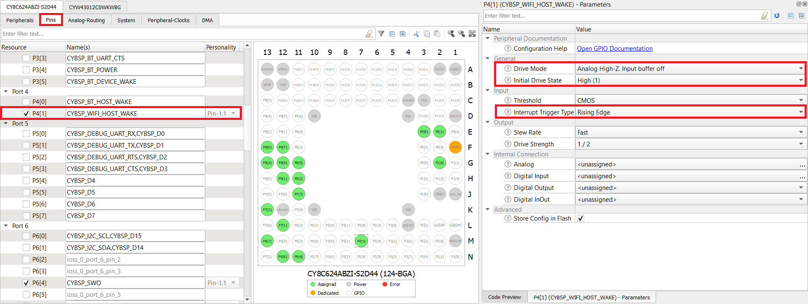

    <br>

   **CY8CPROTO-062-4343W:**

   1. Enable the host WAKE pin **P0[4]** and name it *CYBSP_WIFI_HOST_WAKE*.

   2. In the **Parameters** pane, change the following:

       - **Drive Mode**: Analog High-Z. Input buffer off

       - **Initial Drive State**: High(1)

       - **Interrupt Trigger Type**: Rising Edge

       


      > **Note:** The Wi-Fi host driver takes care of the drive mode configuration of the host WAKE pin.

3. Go to the tab for the connectivity device and configure the fields as follows. This configuration applies to all [supported kits](#supported-kits). **Figure 6** shows the TCP keepalive offload configuration for CY8CKIT-062S2-43012.

     1. Click on the connectivity device at the top, expand the **Power** option from the list, and then click **Wi-Fi**.

        **Figure 6. Navigate to the Wi-Fi device section**

        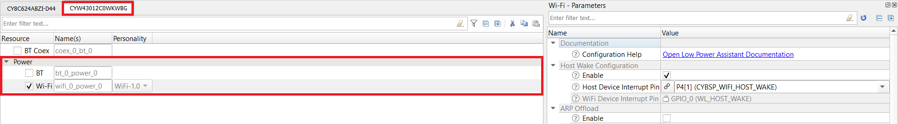

     2. Enable Host Wake Configuration and set **Host Device Interrupt Pin** to **CYBSP_WIFI_HOST_WAKE**.

        **Figure 7. Host WAKE pin**

        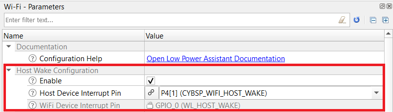

     3. Enable TCP keepalive offload.

     4. Configure the interval, retry interval, and retry count as required by the application. All values are in seconds.

     5. Enter the connection information as needed. You can add up to four TCP socket connections. Specify the following for each TCP socket connection:

        - **Source Port**: Port number of the client (the target kit).

        - **Destination Port**: Port number of the server (the PC running the TCP server). Select the port number between 1 and 65535.

        - **Destination IP Address**: IP address of the server (the PC running the TCP server). Get the IP address of the PC once it gets connected to the Wi-Fi network.

        **Figure 8. Wi-Fi configuration**

        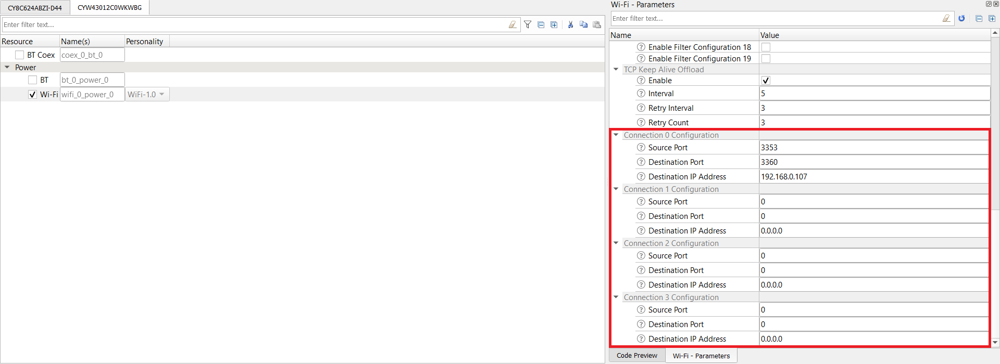

4. ARP offload:
   - Enable ARP offload.

      ARP offload in Peer Auto Reply mode and IP Snooping enabled. In this mode, the WLAN device watches for ARP responses from the host to the network and caches them in the WLAN device host IP table. When an ARP request comes from the network peers, the WLAN device constructs the ARP response packet and sends it to the requesting device without interrupting the host.

      **Figure 9. ARP offload configuration**

      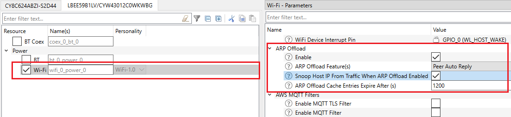

5. Packet filter offload:
   - Enable Packet Filter Offload.

      The following packet filters are enabled. This means that only these WLAN packet types will be allowed to reach the network stack of the host MCU. These are the minimum required packet types which should be allowed so that the host can establish and maintain a Wi-Fi connection with the AP.

      ARP (0x806)
      802.1X (0x888E)
      DHCP (68)
      DNS (53)

      Additionally, it allows the following packet types as the application establishes a TCP socket connection with a remote TCP server. The TCP socket connection will fail if the following packets are not allowed. Modify the port numbers to match your TCP client and server network configuration accordingly.

      TCP client port number (3353) as both Source and Destination ports
      TCP server port number (3360) as both Source and Destination ports

      **Figure 10. Packet Filter configuration**

        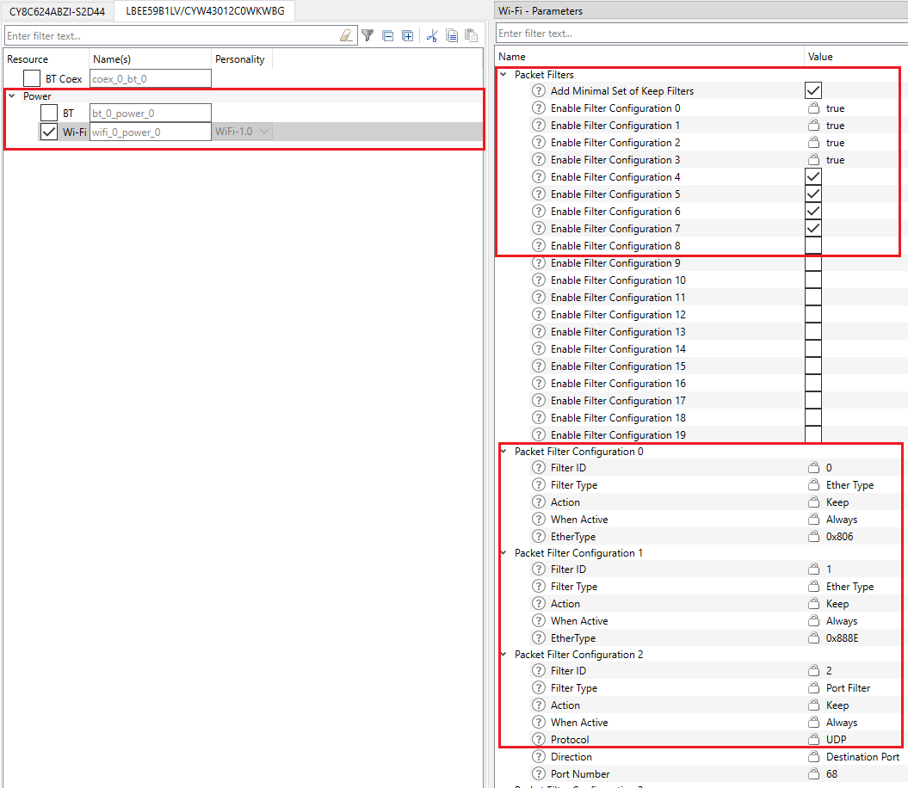

      **Figure 11. Packet Filter configuration**

        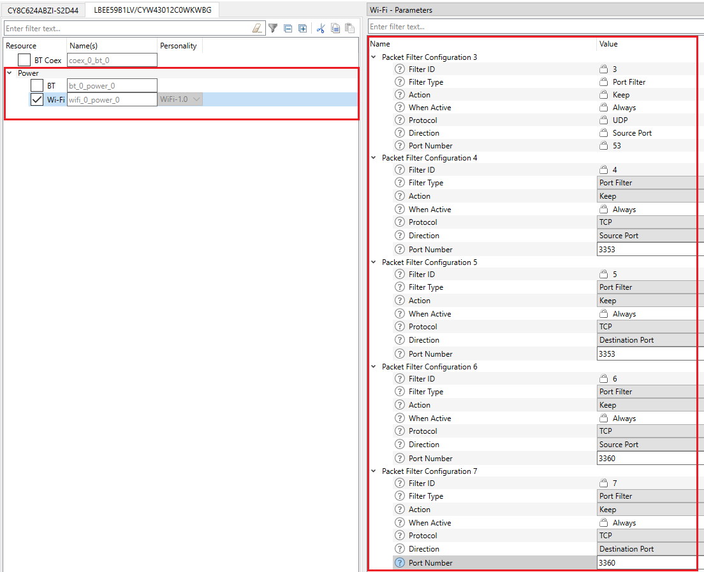


4. Select **File** > **Save**.

   The generated source files *cycfg_connectivity_wifi.c* and *cycfg_connectivity_wifi.h* will be in the *GeneratedSource* folder, which is present in the same location from where you opened the *design.modus* file.

<br>

## Typical current measurement values

This section provides the typical current measurement values for the CY8CKIT-062S2-43012 kit when PSoC&trade; 6 MCU is operated with Arm® Cortex®-M4 running at 100 MHz and at 1.1 V with full RAM retention.

**Figure 12. Test network setup**

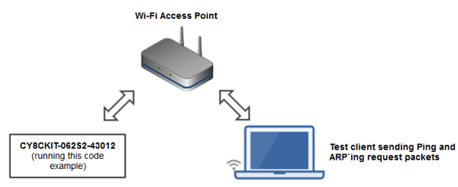

To realize the capability of WLAN offloads and their impact on the host MCU in terms of power savings, the current measurement has been done by considering the following cases.

To simulate a congested network environment, another Wi-Fi client device has been associated to the same network to which the target kit has associated. In all these current measurement cases, the role of the client device is to send ping and ARP request packets periodically in its configured interval to the IP address of the target kit. Based on whether the LPA offloads are enabled, the host MCU stays in deep sleep power mode or wake up because of the ping and arp-ping requests from the client device.

WLAN offloads can be enabled or disabled in the Wi-Fi parameters using the Device configurator.

It is important to have the same test network setup (only the target kit and the test client machine are connected to the AP) as shown in **Figure 12** to reduce the network traffic such as broadcast and multicast packets from associated clients which could wake the Host MCU from deep sleep during the test.

> **Note:** PSoC&trade; 6 MCU and Wi-Fi device current numbers are measured and averaged over 20 seconds in all the following cases. Current measurements are taken when the associated Wi-Fi client sends a ping request every 5 seconds and an arp-ping request every 10 seconds to the IP address of the target kit.

**AP configuration:**
- DTIM: 3
- Beacon interval: 100 ms
- Band: 5 GHz

**Case 1:**
All WLAN offloads enabled (by default).

- PSoC&trade; 6 MCU stays in deep sleep.
- The WLAN device responds to ARP request packets.
- The WLAN device discards ping request packets.

 PSoC&trade; 6 MCU current | CYW43012 Wi-Fi current | PSoC&trade; 6 MCU + CYW43012 Wi-Fi current
 :----------------- | :------------------ | :-------------------------------
 27 uA               | 270 uA                | 297 uA

<br>

**Case 2**:
ARP offload is disabled (disabled using the device configurator).

- PSoC&trade; 6 MCU wakes up to respond to ARP request packets.
- The WLAN device discards ping request packets.

 PSoC&trade; 6 MCU current | CYW43012 Wi-Fi current | PSoC&trade; 6 MCU + CYW43012 Wi-Fi current
 :----------------- | :------------------ | :-------------------------------
 66 uA               | 634 uA                | 700 uA

<br>

**Case 3**:
ARP and packet filter offloads are disabled (disabled using the device configurator).

- PSoC&trade; 6 MCU wakes up to respond to ARP requests and ping request packets.

 PSoC&trade; 6 MCU current | CYW43012 Wi-Fi current | PSoC&trade; 6 MCU + CYW43012 Wi-Fi current
 :----------------- | :------------------ | :-------------------------------
 117 uA               | 1.229 mA                | 1.346 mA

<br>

By disabling the WLAN offloads individually, the current consumption of the MCU and WLAN device increases.

With WLAN offloads disabled, the total current consumption (PSoC&trade; 6 MCU + CYW43012) is approximately 1.346 mA, averaged over 20 seconds.

With WLAN offloads enabled, the total current consumption (PSoC&trade; 6 MCU + CYW43012) is approximately 297 uA, averaged over 20 seconds.

This shows that the total current consumption can be reduced by approximately 78% by enabling WLAN offloads.

## Related resources


Resources  | Links
-----------|----------------------------------
Application notes  | [AN228571](https://www.infineon.com/AN228571) – Getting started with PSoC&trade; 6 MCU on ModusToolbox&trade; <br>  [AN215656](https://www.infineon.com/AN215656) – PSoC&trade; 6 MCU: Dual-CPU system design
Code examples  | [Using ModusToolbox&trade;](https://github.com/Infineon/Code-Examples-for-ModusToolbox-Software) on GitHub
Device documentation | [PSoC&trade; 6 MCU datasheets](https://documentation.infineon.com/html/psoc6/bnm1651211483724.html) <br> [PSoC&trade; 6 technical reference manuals](https://documentation.infineon.com/html/psoc6/zrs1651212645947.html)
Development kits | Select your kits from the [Evaluation board finder](https://www.infineon.com/cms/en/design-support/finder-selection-tools/product-finder/evaluation-board)
Libraries on GitHub  | [mtb-pdl-cat1](https://github.com/Infineon/mtb-pdl-cat1) – PSoC&trade; 6 Peripheral Driver Library (PDL)  <br> [mtb-hal-cat1](https://github.com/Infineon/mtb-hal-cat1) – Hardware Abstraction Layer (HAL) library <br> [retarget-io](https://github.com/Infineon/retarget-io) – Utility library to retarget STDIO messages to a UART port <br>  [mtb-pdl-cat2](https://github.com/Infineon/mtb-pdl-cat2) – PSoC&trade; 4 Peripheral Driver Library (PDL)
Tools  | [Eclipse IDE for ModusToolbox&trade;](https://www.infineon.com/modustoolbox) – ModusToolbox&trade; is a collection of easy-to-use software and tools enabling rapid development with Infineon MCUs, covering applications from embedded sense and control to wireless and cloud-connected systems using AIROC&trade; Wi-Fi and Bluetooth&reg; connectivity devices.

<br>

## Other resources


Infineon provides a wealth of data at www.infineon.com to help you select the right device, and quickly and effectively integrate it into your design.

For PSoC&trade; 6 MCU devices, see [How to design with PSoC&trade; 6 MCU - KBA223067](https://community.infineon.com/docs/DOC-14644) in the Infineon Developer community.


## Document history

Document title: *CE229926* - *WLAN offloads*

 Version | Description of change
 ------- | ---------------------
 1.0.0   | New code example
 1.1.0   | Fixed IAR compiler warning and minor changes to the Makefile
 2.0.0   | Major update to support ModusToolbox&trade; v2.2 and LPA v3.0.0.<b>This version is not backward compatible with ModusToolbox&trade; v2.1
 2.1.0   | Added support for Rapid IoT Connect Developer Kit (CYSBSYSKIT-DEV-01)
 2.2.0   | Updated to FreeRTOS v10.3.1
 2.3.0   | Updated to FreeRTOS v10.4.3 <br> Added support for new kits
 3.0.0   | Updated to support ModusToolbox&trade; v2.4 <br> Added support for new kits <br> Updated the BSPs to v3.X
 4.0.0   | Major update to support ModusToolbox&trade; v3.0. This version is not backward compatible with previous versions of ModusToolbox&trade;.
 4.1.0   | Added the BSP support for CY8CEVAL-062S2-LAI-43439M2
 4.2.0   | Added support for CY8CPROTO-062S2-43439.
 5.0.0   | Added ARP and packer filter offload functionalities.
 5.1.0   | Added support for CY8CEVAL-062S2-MUR-4373EM2 and CY8CEVAL-062S2-MUR-4373M2
 5.2.0   | Added support for KIT_XMC72_EVK_MUR_43439M2 and updated to support ModusToolbox&trade; v3.1
 5.3.0   | Added support for CY8CKIT-062S2-AI
 5.4.0   | Removed support for KIT_XMC72_EVK_MUR_43439M2 due to required board changes
 5.5.0   | Added support for CY8CEVAL-062S2-CYW955513SDM2WLIPA
<br>


All referenced product or service names and trademarks are the property of their respective owners.

The Bluetooth&reg; word mark and logos are registered trademarks owned by Bluetooth SIG, Inc., and any use of such marks by Infineon is under license.


---------------------------------------------------------

© Cypress Semiconductor Corporation, 2020-2024. This document is the property of Cypress Semiconductor Corporation, an Infineon Technologies company, and its affiliates ("Cypress").  This document, including any software or firmware included or referenced in this document ("Software"), is owned by Cypress under the intellectual property laws and treaties of the United States and other countries worldwide.  Cypress reserves all rights under such laws and treaties and does not, except as specifically stated in this paragraph, grant any license under its patents, copyrights, trademarks, or other intellectual property rights.  If the Software is not accompanied by a license agreement and you do not otherwise have a written agreement with Cypress governing the use of the Software, then Cypress hereby grants you a personal, non-exclusive, nontransferable license (without the right to sublicense) (1) under its copyright rights in the Software (a) for Software provided in source code form, to modify and reproduce the Software solely for use with Cypress hardware products, only internally within your organization, and (b) to distribute the Software in binary code form externally to end users (either directly or indirectly through resellers and distributors), solely for use on Cypress hardware product units, and (2) under those claims of Cypress's patents that are infringed by the Software (as provided by Cypress, unmodified) to make, use, distribute, and import the Software solely for use with Cypress hardware products.  Any other use, reproduction, modification, translation, or compilation of the Software is prohibited.
<br>
TO THE EXTENT PERMITTED BY APPLICABLE LAW, CYPRESS MAKES NO WARRANTY OF ANY KIND, EXPRESS OR IMPLIED, WITH REGARD TO THIS DOCUMENT OR ANY SOFTWARE OR ACCOMPANYING HARDWARE, INCLUDING, BUT NOT LIMITED TO, THE IMPLIED WARRANTIES OF MERCHANTABILITY AND FITNESS FOR A PARTICULAR PURPOSE.  No computing device can be absolutely secure.  Therefore, despite security measures implemented in Cypress hardware or software products, Cypress shall have no liability arising out of any security breach, such as unauthorized access to or use of a Cypress product. CYPRESS DOES NOT REPRESENT, WARRANT, OR GUARANTEE THAT CYPRESS PRODUCTS, OR SYSTEMS CREATED USING CYPRESS PRODUCTS, WILL BE FREE FROM CORRUPTION, ATTACK, VIRUSES, INTERFERENCE, HACKING, DATA LOSS OR THEFT, OR OTHER SECURITY INTRUSION (collectively, "Security Breach").  Cypress disclaims any liability relating to any Security Breach, and you shall and hereby do release Cypress from any claim, damage, or other liability arising from any Security Breach.  In addition, the products described in these materials may contain design defects or errors known as errata which may cause the product to deviate from published specifications. To the extent permitted by applicable law, Cypress reserves the right to make changes to this document without further notice. Cypress does not assume any liability arising out of the application or use of any product or circuit described in this document. Any information provided in this document, including any sample design information or programming code, is provided only for reference purposes.  It is the responsibility of the user of this document to properly design, program, and test the functionality and safety of any application made of this information and any resulting product.  "High-Risk Device" means any device or system whose failure could cause personal injury, death, or property damage.  Examples of High-Risk Devices are weapons, nuclear installations, surgical implants, and other medical devices.  "Critical Component" means any component of a High-Risk Device whose failure to perform can be reasonably expected to cause, directly or indirectly, the failure of the High-Risk Device, or to affect its safety or effectiveness.  Cypress is not liable, in whole or in part, and you shall and hereby do release Cypress from any claim, damage, or other liability arising from any use of a Cypress product as a Critical Component in a High-Risk Device. You shall indemnify and hold Cypress, including its affiliates, and its directors, officers, employees, agents, distributors, and assigns harmless from and against all claims, costs, damages, and expenses, arising out of any claim, including claims for product liability, personal injury or death, or property damage arising from any use of a Cypress product as a Critical Component in a High-Risk Device. Cypress products are not intended or authorized for use as a Critical Component in any High-Risk Device except to the limited extent that (i) Cypress's published data sheet for the product explicitly states Cypress has qualified the product for use in a specific High-Risk Device, or (ii) Cypress has given you advance written authorization to use the product as a Critical Component in the specific High-Risk Device and you have signed a separate indemnification agreement.
<br>
Cypress, the Cypress logo, and combinations thereof, ModusToolbox, PSoC, CAPSENSE, EZ-USB, F-RAM, and TRAVEO are trademarks or registered trademarks of Cypress or a subsidiary of Cypress in the United States or in other countries. For a more complete list of Cypress trademarks, visit www.infineon.com. Other names and brands may be claimed as property of their respective owners.
